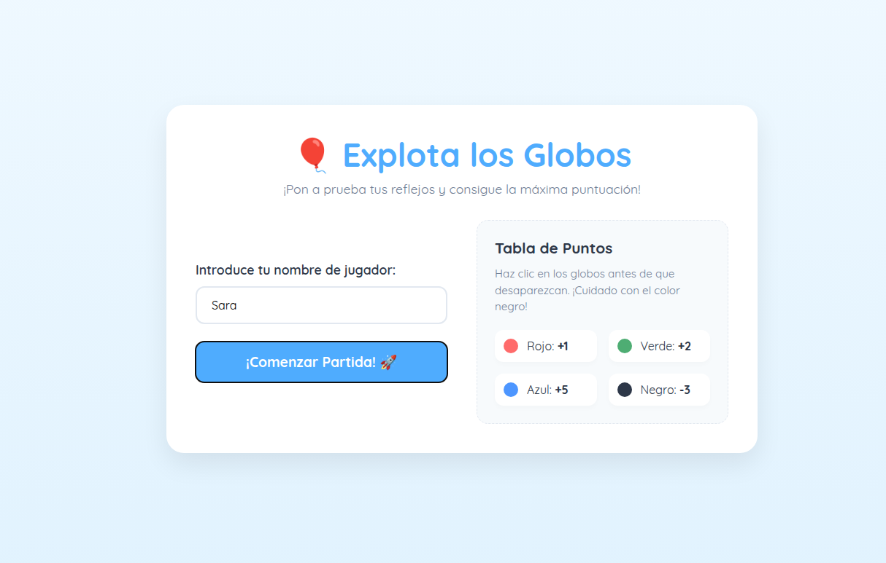
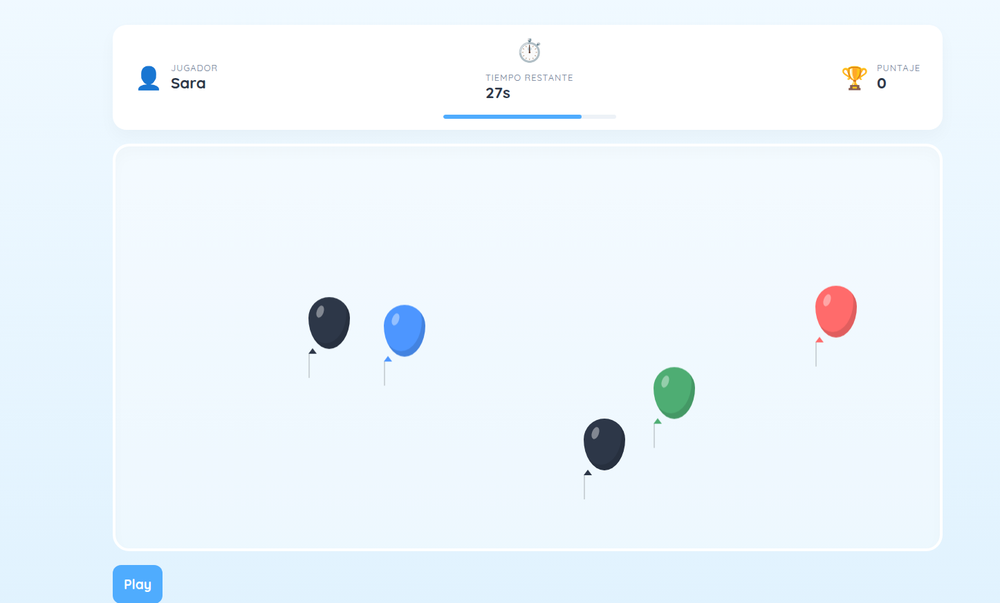
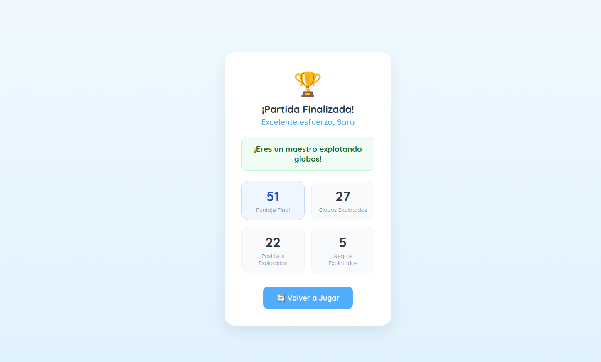
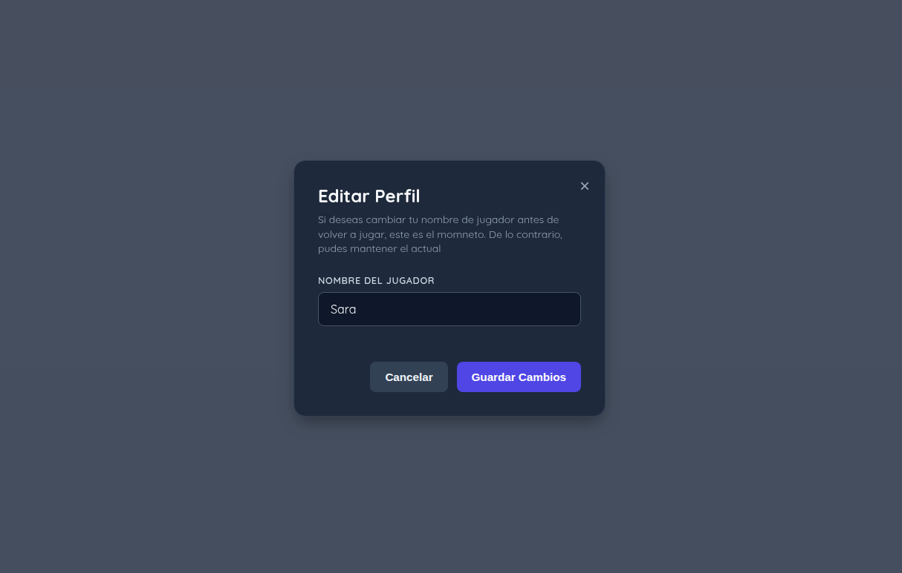

# 🎈 Explota los Globos

**Estudiante:** _Sara Ithamar Valdéz Sanic

## Descripción del juego

Explota los Globos es un juego infantil desarrollado en React. Durante 30 segundos aparecen globos de distintos colores en el área de juego, y el jugador debe hacer clic sobre ellos antes de que suban y desaparezcan por la parte superior de la pantalla.

Cada color de globo tiene un valor distinto:

| Color | Puntos |
|---|---|
| 🔴 Rojo | +1 |
| 🟢 Verde | +2 |
| 🔵 Azul | +5 |
| ⚫ Negro | -3 |

Antes de iniciar, el jugador ingresa su nombre. Al terminar el tiempo, se muestra una pantalla de resultados con el puntaje final, la cantidad de globos explotados (totales, positivos y negros) y un mensaje según el desempeño obtenido. Desde ahí el jugador puede volver a jugar.

## Capturas de Pantalla






## Link de GithubPages
https://24saravaldez-tech.github.io/Juego-Explota-el-Globo/


## Instrucciones para ejecutar el proyecto

```bash
# Clonar el repositorio
git clone git@github.com:24saravaldez-tech/Juego-Explota-el-Globo.git
cd Juego-Explota-el-Globo-main

# Instalar dependencias
npm install

# Levantar el servidor de desarrollo
npm run dev
```

El proyecto se abrirá en `http://localhost:5173`.

## Conceptos de React utilizados

- **Componentes:** la aplicación está dividida en componentes con responsabilidad clara — `PantallaRegistro`, `PantallaJuego`, `PantallaResultados`, `ModalCambioNombre`, `Globo`, `Temporizador` y `FormJugador`.
- **Props:** `PantallaJuego` le pasa a cada `Globo` su `id`, `color`, `x`, `y`, `points` y `velocidad`, además de las funciones que maneja al hacer clic o al llegar arriba.
- **Estados:** se manejan con `useState` el nombre del jugador, el puntaje, el tiempo restante, la lista de globos visibles, la pantalla activa y las estadísticas de la partida (total de globos, positivos y negros explotados).
- **Context API:** ver sección siguiente.
- **Eventos:** `onClick` para explotar un globo y para los botones de navegación, `onChange` para el input del nombre, `onAnimationEnd` para detectar cuándo un globo termina su recorrido sin haber sido explotado.
- **Renderizado condicional:** `PantallaInicial` decide qué pantalla mostrar según el valor de `cambioPantalla` (registro, partida, resultados o modal de cambio de nombre).
- **Manejo de listas:** los globos activos se guardan en un array de estado y se recorren con `.map()`, cada uno con un `id` único generado mediante un contador (`useRef`).
- **Efectos y temporizadores:** `useEffect` con `setInterval` controla la cuenta regresiva de 30 segundos y la generación de un globo nuevo cada segundo; ambos se limpian con `clearInterval` al desmontar o al terminar la partida.

## Uso de Context API

`JuegoContext` centraliza todo el estado global del juego: la pantalla activa, el nombre del jugador, el puntaje, las estadísticas de la partida y la lista de globos visibles, junto con las funciones que los modifican (`Jugar`, `explotarGlobo`, `eliminarPorTecho`, `generadorBallons`, entre otras). Esto evita pasar props manualmente a través de varios niveles de componentes que no la necesitan directamente (*prop drilling*): cualquier componente que esté dentro de `JuegoProvider` puede leer o actualizar el estado del juego con `useContext(JuegoContext)`, sin importar en qué nivel del árbol se encuentre.

## Dificultad principal encontrada

La parte más difícil fue lograr que los globos aparecieran de forma continua y aleatoria durante toda la partida, en vez de un número fijo de cuatro globos. El primer intento generaba un globo nuevo cada vez que uno explotaba o llegaba arriba, pero tenía varios problemas: los ids se repetían entre globos de un mismo color (lo que rompía la identificación única que exige React en las listas), y la función que armaba el globo nuevo terminaba anidando un array dentro de otro en vez de agregar un objeto plano a la lista.

### Cómo la resolví

Separé el problema en piezas más pequeñas:

1. Una plantilla fija con solo el color y los puntos de cada tipo de globo (sin posición ni id, porque eso debe calcularse en el momento en que el globo nace).
2. Un contador con `useRef` que entrega un id nuevo y único cada vez que se llama, sin provocar renders adicionales.
3. Una función pura (`generadorBallons`) que arma y devuelve un solo globo completo, con id, color, puntos y posición calculados en ese instante.
4. Un `setInterval` dentro del componente `Temporizador`, sincronizado con la cuenta regresiva, que agrega un globo nuevo a la lista cada segundo mientras la partida está activa, y se detiene con `clearInterval` cuando el tiempo llega a cero.

Con esta separación, cada pieza tiene una sola responsabilidad y los globos nacen de forma continua y aleatoria sin colisiones de id.